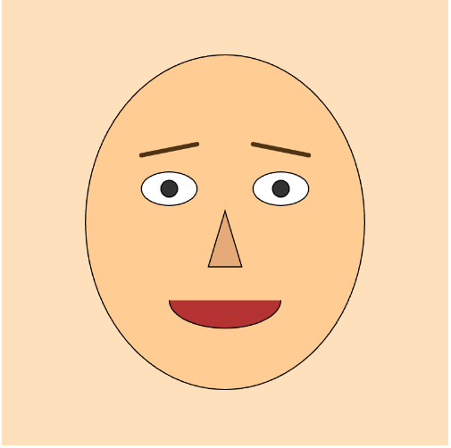
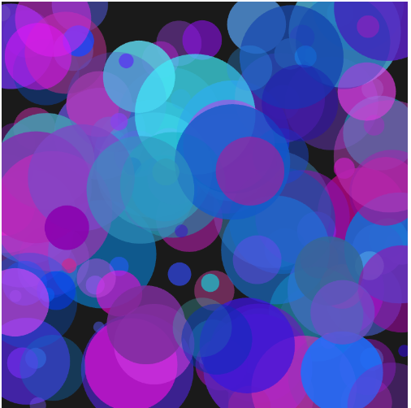
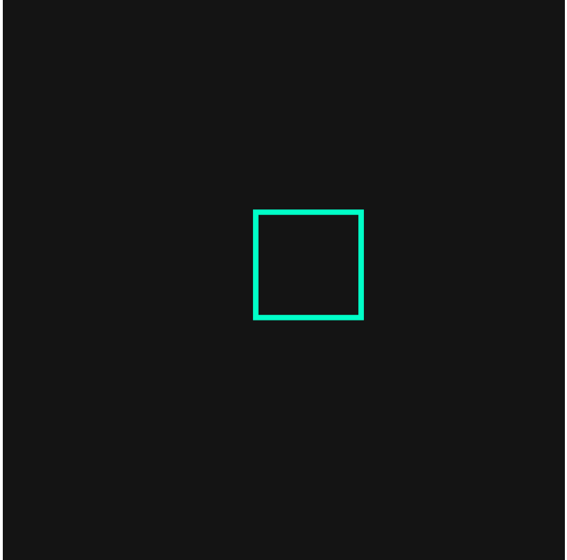
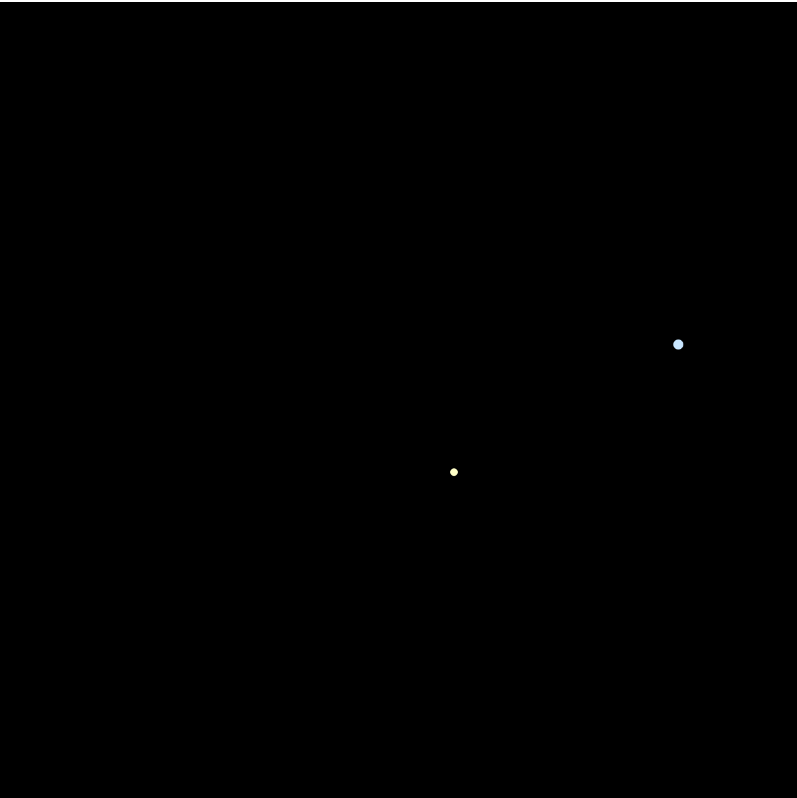
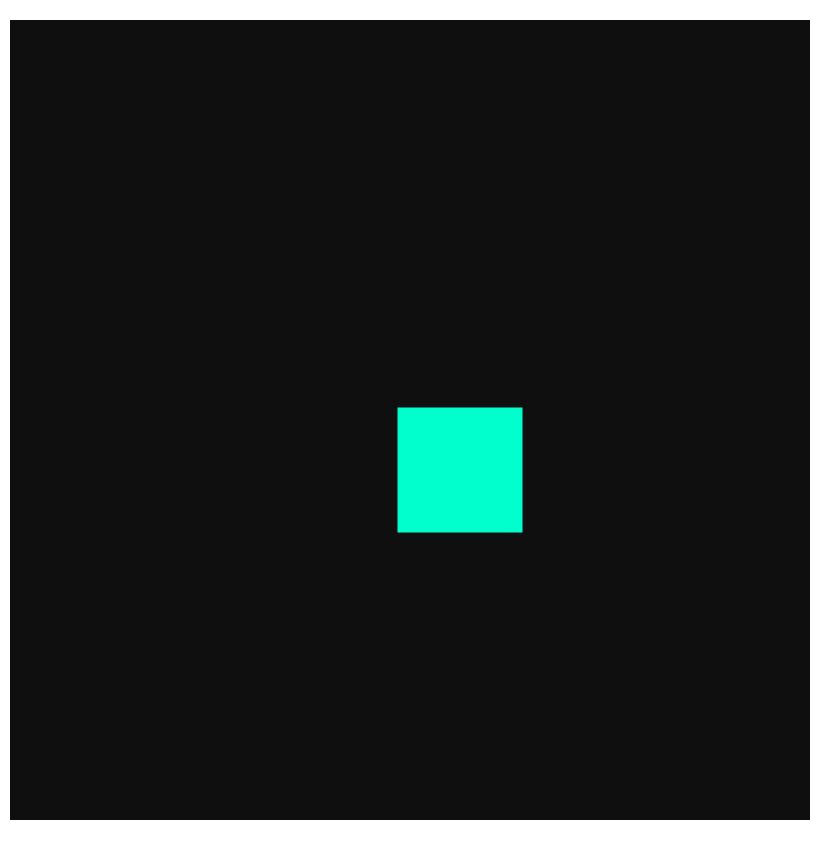
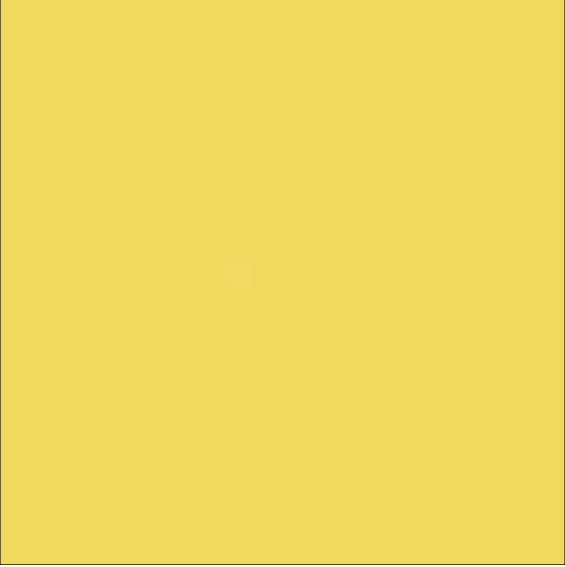

# CART253
This is my introductory course repository for cool projects and stuff at Concordia University
# My Reintegration into Programming

ARNOLD IRÉNÉE UZABAKIRIHO

# Purpose of this website

The purpose of the website is to introduce a preview of the type of content and subjects I'll learn throughout this course and is a glimpse into what the projects can look like or the type of things I'll be doing for this course.

# My journal

[This is the journal](journal.md)

# Where you can find Me

[GitHub link](https://github.com/ArnoldUza)

# My Prototypes

[Landscape Exercise](https://sub5gamingaddict.github.io/cart253/instructions-challenge/)

### Instructions Prototype 1: Face

[Live version](https://ArnoldUza.github.io/CART253/topics/Instructions/prototype-1-face/) | [Code](https://github.com/ArnoldUza/CART253/tree/main/topics/Instructions/prototype-1-face)

### Instructions Prototype 2: Color Field

[Live version](https://ArnoldUza.github.io/CART253/topics/Instructions/prototype-2-colorfield/) | [Code](https://github.com/ArnoldUza/CART253/tree/main/topics/Instructions/prototype-2-colorfield)

### Instructions Prototype 3: Glitch Grid

[Live version](https://ArnoldUza.github.io/CART253/topics/Instructions/prototype-3-glitchgrid/) | [Code](https://github.com/ArnoldUza/CART253/tree/main/topics/Instructions/prototype-3-glitchgrid)

## Prototyping: Variables

### Variables Prototype 1: Movement & Math
Using a yellow circle to explore linear translation math combined with automated random vertical jitter values.

[Live version](https://arnolduza.github.io/CART253/topics/Variables/variables-prototype-1/) | [Code](https://github.com/ArnoldUza/CART253/tree/main/topics/Variables/variables-prototype-1)

### Variables Prototype 2: Growth & Interactivity
An interactive rectangular canvas matrix locked to cursor updates featuring oscillating stroke scale profiles.

[Live version](https://arnolduza.github.io/CART253/topics/Variables/variables-prototype-2/) | [Code](https://github.com/ArnoldUza/CART253/tree/main/topics/Variables/variables-prototype-2)

### Variables Prototype 3: Atmosphere & Color (Shooting Stars)
A celestial deep-space simulation utilizing coordinate tracking to guide automated falling star streaks across canvas loops.

[Live version](https://arnolduza.github.io/CART253/topics/Variables/variables-prototype-3/) | [Code](https://github.com/ArnoldUza/CART253/tree/main/topics/Variables/variables-prototype-3)

## Prototyping: Conditionals

### Conditionals Prototype 1: The Crossroads
A ball moves across the canvas and splits onto a random upward or downward path when it hits the exact center.

[Live version](https://arnolduza.github.io/CART253/topics/Conditionals/conditionals-prototype-1/) | [Code](https://github.com/ArnoldUza/CART253/tree/main/topics/Conditionals/conditionals-prototype-1)

### Conditionals Prototype 2: The Shy Shape
A teal square tracks your cursor and instantly turns red and runs away if your mouse pointer gets too close.

[Live version](https://arnolduza.github.io/CART253/topics/Conditionals/conditionals-prototype-2/) | [Code](https://github.com/ArnoldUza/CART253/tree/main/topics/Conditionals/conditionals-prototype-2)

### Conditionals Prototype 3: The Lottery Field
A background system rolls a random decimal number every frame, triggering a bright yellow full-screen flash on a rare 0.5% hit.

[Live version](https://arnolduza.github.io/CART253/topics/Conditionals/conditionals-prototype-3/) | [Code](https://github.com/ArnoldUza/CART253/tree/main/topics/Conditionals/conditionals-prototype-3)