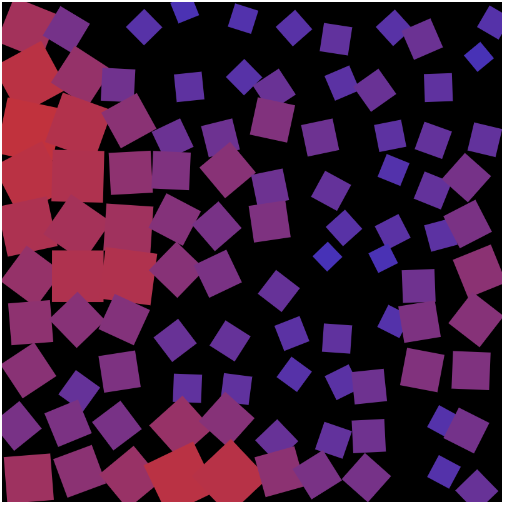
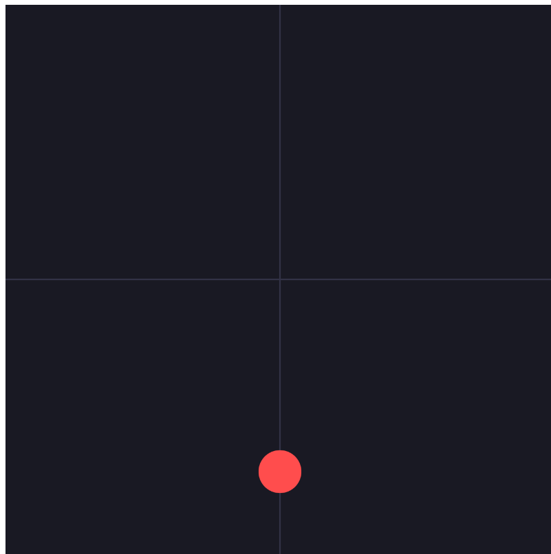

# Reflective Journal

I don't journal often but I will say that my reintegration into coding is definitely going to be arduous but fun I think. There are a lot of things I forgot from my CEGEP days and the main thing I'm tryng to do with this is relearn some things and see what it is that I actually like. I just made the markdown on VS itself so I'm not sure if there's anything that actually surprised me. I hope that anybody who sees my work from here on out understands the concepts I want to convey and the novelty of it all. I'm actually aspiring to improve my creativity with the art I can make in this course and all the techniques I can learn.

## Instructions Prototypes

Working through these three prototypes was my first real hands-on look at how much a p5 sketch can change just by nudging arguments. The face prototype felt the most intuitive — placing ellipses and triangles at coordinates is basically just eyeballing a drawing. The color field prototype surprised me the most: switching to colorMode(HSB) instead of RGB made random color generation actually look intentional instead of muddy, because you're only randomizing hue while keeping saturation and brightness controlled.

The rotated grid was the hardest to wrap my head around — combining translate(), rotate(), and noise() inside push()/pop() took a few tries before I understood why skipping push()/pop() made every later shape rotate too. Once it clicked, though, it was the most fun to tweak, since tiny changes to the noise scale completely changed the pattern.

If someone looked at these three, I'd want them to notice how different the same handful of functions (ellipse, rect, random, rotate) can look depending on what you feed them. The grid prototype is the one I'd want to develop further — animating the noise offset over time instead of drawing it static seems like a natural next step.

## Variables Prototype

Working on these prototypes showed me how much a p5 sketch changes when you replace static numbers with variables that shift over time. 

In Prototype 1 (Movement & Math), I liked seeing how basic addition moves a shape across the screen, while a little bit of randomness adds a cool, shaky jitter effect. It was an easy way to understand how to control motion using logic.

Prototype 2 (Growth & Interactivity) focused on user control. Locking the shape to mouseX and mouseY lets the user guide the sketch, while using an if-statement to multiply the scale direction by -1 created a smooth, automated breathing effect that keeps the box pulsing within clean boundaries.

For Prototype 3 (Atmosphere & Color), I wanted to focus on mood. I created shooting stars streaking across a black canvas. Figuring out how to track their independent speeds and reset them to random starting points when they left the canvas boundaries taught me how to loop automated cycles cleanly. 

Overall, I wanted these three projects to show a clear progression from pure math, to user interaction, and finally to an automated scene.

## Conditionals Prototype

Working on these three prototypes showed me how conditionals can add decision-making, personality, and random surprise to a script instead of just running down a predictable path.

In Prototype 1 (The Crossroads), I liked seeing how an if-statement can intercept an object and force it to make a choice. Splitting a ball's horizontal vector into an automated 50/50 vertical path at the exact center lines showed me how branching paths completely change layout dynamics.

Prototype 2 (The Shy Shape) made code feel more human. Using dist() to check if the user's cursor got too close allowed me to give an object a basic survival instinct. Flipping its color property to an alert state and triggering evasive vector movements when a proximity threshold is crossed made a basic shape feel alive.

For Prototype 3 (The Lottery Field), I explored pure chance. Setting up a conditional structure that checks for a narrow, fractional decimal roll (< 0.5%) created a great feeling of rarity. The canvas remains completely dark for long frames until an unpredictable winning hit triggers an instant full-screen yellow flash.

